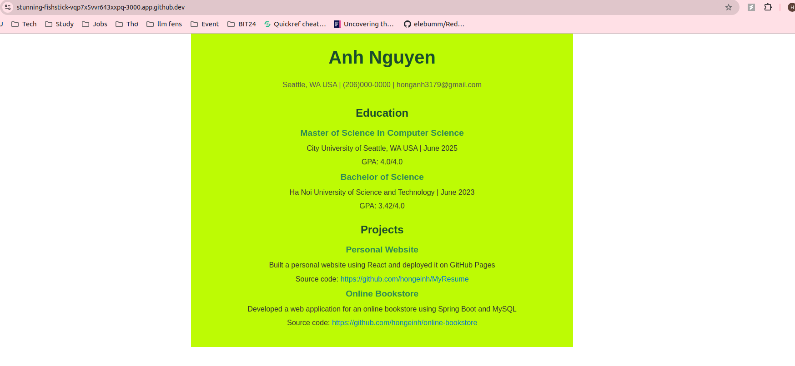

# PE01 Analysis

## Input
The input in this program is the Resume component that contains static information about Anh Nguyen, including:
* name
* contact
* education
* project experiences. 

All information is hardcoded into the component and doesn't require any external input or user interaction to function.

## Process
The main processing happens within the Resume component, which organizes the information into various sections: "Education" and "Projects".  
Each section having relevant details like degree names, university, and project descriptions.   
React’s rendering system converts it into HTML and it is displayed in the browser.

## Output 
The output is a dynamically-rendered web page displaying the resume.   
The page includes sections such as the user's name, contact information, education history, and project details. 

