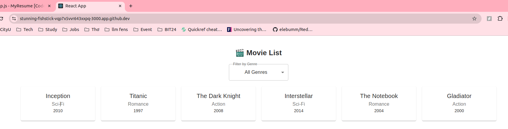
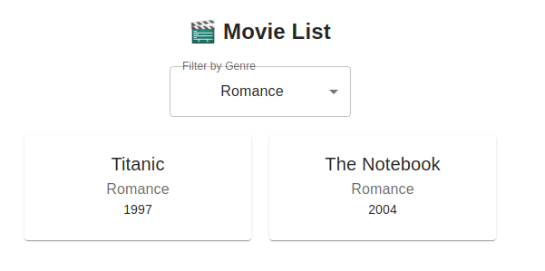
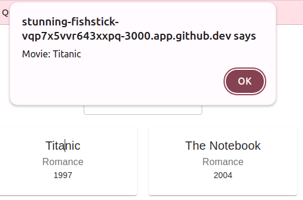

# PE02 Analysis

## Input
The program takes a predefined list of movies as input, where each movie has three properties: 
* Title
* Genre
* Release Year. 

Additionally, there is a dropdown menu for filtering movies by genre. By choosing a genre, the list of movies will be dynamically updated to show movies with the selected genre only.

User can also view a movie title alert by clicking in each movie card. 

## Process
The program initializes with a list of movies and manages state using React hooks.
The `useState` hook stores the currently selected genre. When the user selects a genre, the movie list is filtered accordingly using. The app also listens for click events on movie cards and triggers an alert displaying the movie title. 

## Output 
The program displays a list of movie cards, each containing the title, genre, and release year. When a genre is selected, only the relevant movies appear. 

## Result
### Movie List
  
### Filtered movies
  
### Movie detail

