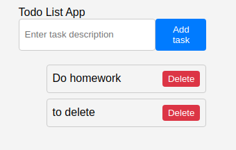
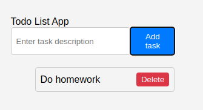

# PE03 Analysis

## Input
The program takes user input through a text field where users can type the description of a new ToDo task. Additionally, the program listens for click events on the "Add Task" button to add the task to the list and on the "Delete" button to remove a specific task. The input is stored in the component's state using the `useState` hook.

## Process
The program initializes with an empty list of ToDos, managed using the `useState` hook. When the user types a task and clicks the "Add Task" button, the program generates a unique ID for the task using the uuid library and adds it to the list. The `useState` hook updates the state, triggering a re-render of the component. Similarly, when the user clicks the "Delete" button next to a task, the program filters out the task with the corresponding ID and updates the state. The `.map()` function dynamically renders the list of tasks based on the current state.

## Output 
The program displays a list of ToDo tasks, each with a description and a "Delete" button. The "Add Task" button is styled in blue, and the "Delete" button is styled in red for better user experience. The list updates dynamically as tasks are added or removed, providing real-time feedback to the user.

## Result
### Add task
  
### Delete task

