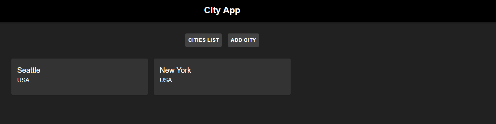
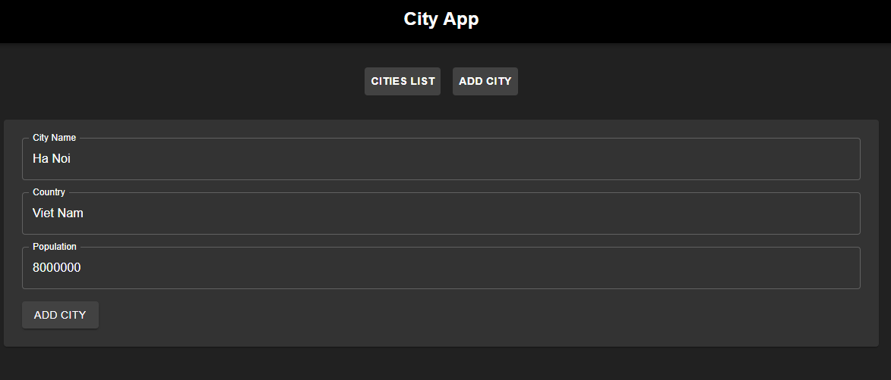
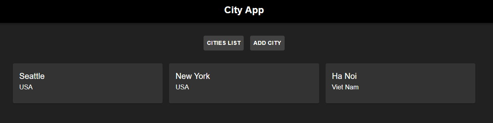
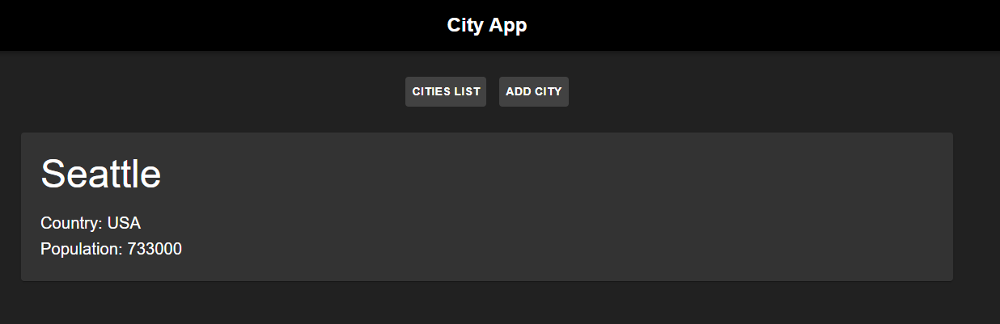

# PE04 Analysis

## Input
The program takes user input through a form on the "Add City" page, where users can enter:
* City Name
* Country
* Population

The program lets user navigate via two buttons "Cities List" and "Add City" and URL parameters for viewing individual city details `/city/:id`.

## Process
The program uses React and React Router to manage a single-page application with three main views: a city list, an add city form, and city details.
It maintains a state array of cities in the App component through a constant `cities` and allows users to add new cities via the form, appending them to the state with an incrementally generated ID.

The program can also routes users between views:
* /cities: Displays all cities as cards.
* /add-city: Shows a form to input new city data.
* /city/:id: Shows details for a specific city.

## Output 
The program displays: 
* On the /cities route: city's name and country in white text, clickable to view details.
* On the /add-city route: text inputs for creating a new city.
* On the /city/:id route: the selected city's name, country, and population.

## Result
### City list
  
### Add city

### New City List
  
### City Detail
  

