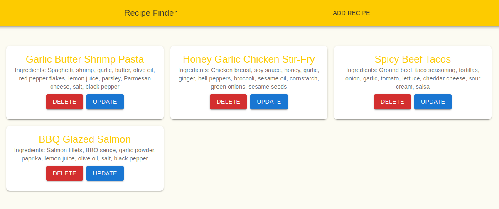
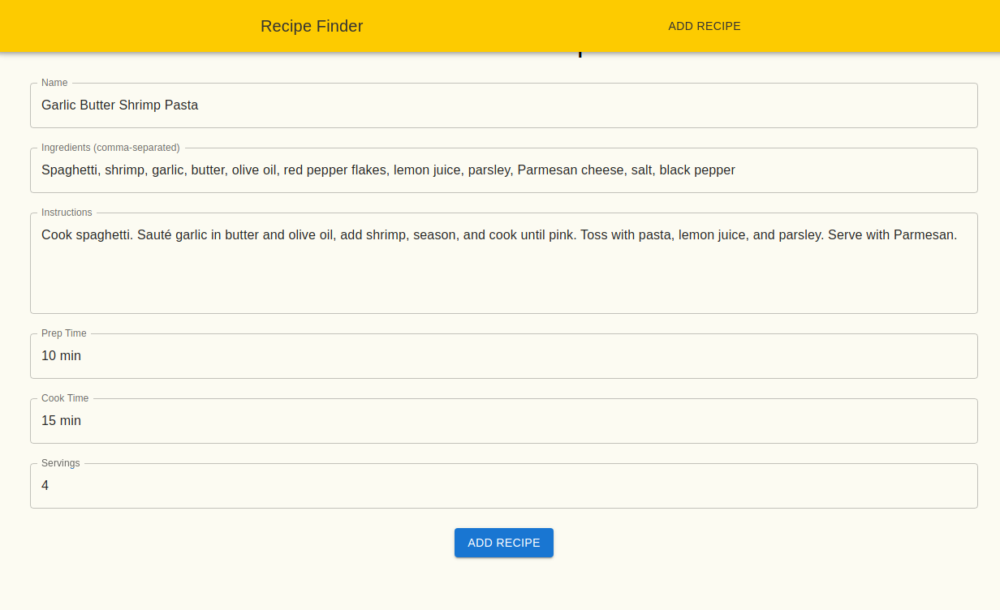
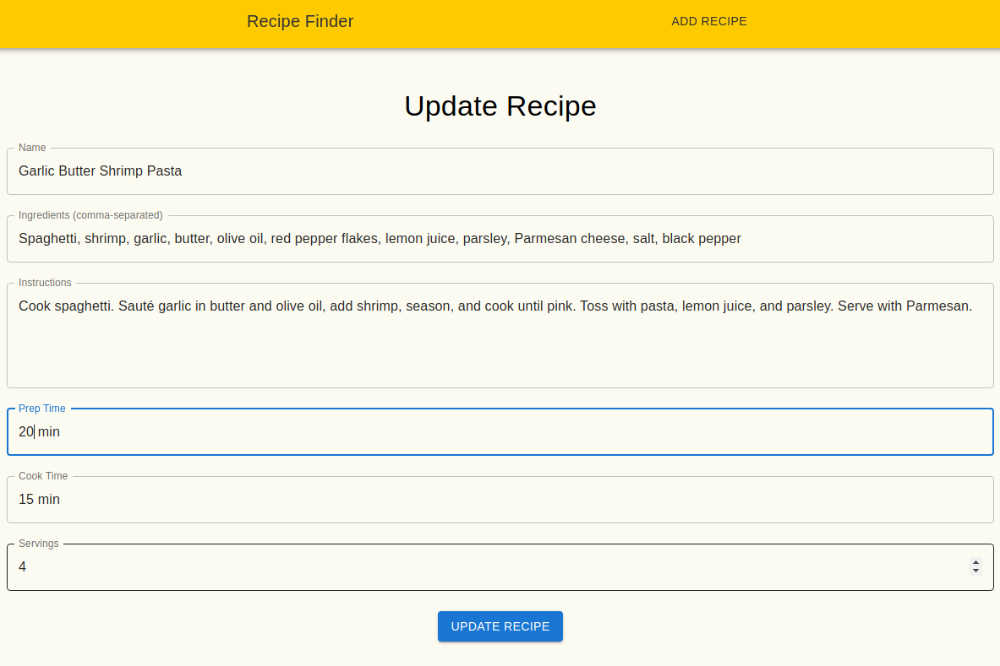
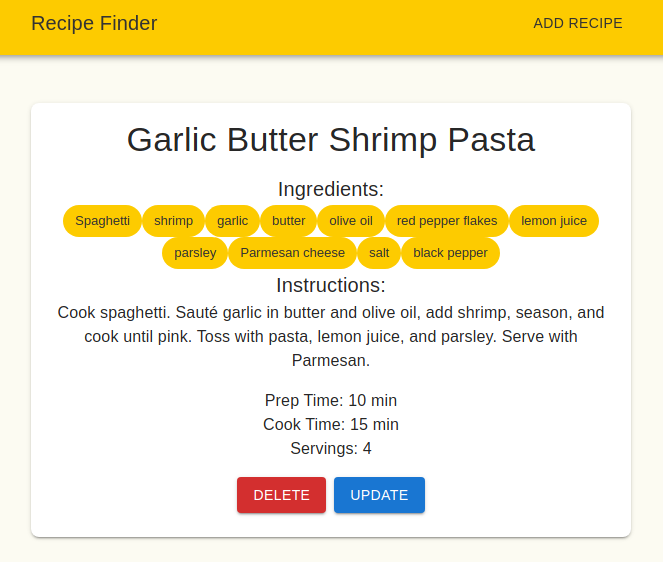
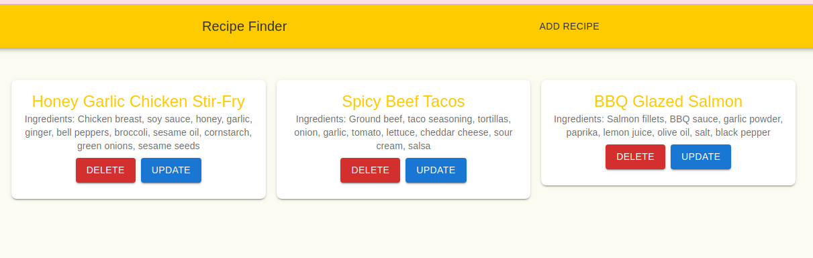

# PE05 Analysis

## Input
The program takes user input on the "Add Recipe" and "Update Recipe" page.

In both pages, users can enter:
* Recipe Name
* Ingredients
* Instructions
* Prep time
* Cook time
* Servings

The program lets user navigate via buttons "Add List" and "Update Recipe" and URL parameters for viewing individual recipe details `/recipe/:id`.

User can also delete the recipe via "Delete" button.

## Process
The program uses React and React Router to manage a single-page application with 4 main views: a recipe list, an add recipe form, an update recipe form, and recipe detail.

It maintains a state array of recipe in the App component through a constant `recipes` and allows users to add new recipe via the form, saving the new recipe to the MongoDB.

The program can also routes users between views:
* / : Displays all recipes as cards.
* /add: Shows a form to input new recipe data.
* /recipe/:id: Shows details for a specific recipe.
* /update/:id: Update the details for a specific recipe

## Output 
The program displays: 
* On the / route: recipe's name and ingredients as black text on white background, with 2 buttons "Delete" and "Update"
* On the /add route: text inputs for creating a new recipe.
* On the /update/:id route: text inputs for updating the specified recipe.
* On the /recipe/:id route: the selected recipe's information, including name, ingredients, instructions, prep time, cook time, servings.

## Result
### Recipe list
  
### Add recipe

### New Recipe List
  
### Recipe Detail
  
### Delete Recipe
  

